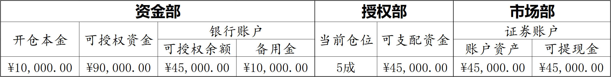

# 资金管理与仓位控制 Fund Management and Position Control

资金管理与仓位控制，涉及三重责任：一，资金保管责任。二，资金授权责任。三，资金使用责任。

负责资金保管的，我们成立一个部门叫“资金部”。负责资金授权的，我们成立一个部门叫“授权部”。负责资金使用的，我们成立一个部门叫“市场部”。三部门的协作模式是：**资金部提供资金供授权部授权给市场部使用**。

我们可以建立一份如下格式的表格，来实时记录当前的协作状态：

 

资金部工作内容：记录本次开仓设定的本金数量，实时报告剩余的可授权资金数量以及备用金数量。

授权部工作内容：根据市场部的盈亏情况，动态调整授权市场部可支配资金的上限，避免巨额损失。

市场部工作内容：合理利用授权部从资金部申请转入证券账户的资金，结合大盘控制仓位空轻重满。

对于市场部的能力，选择<u>“赛马而不相马”</u>，通过授权部动态调节可支配资金上限的机制，最大限度地发挥市场部的投资才能，规避投资风险。这是一个奖励能者、惩罚庸者的有效机制：对于能者，则一步步增加其调配资金的权力；对于庸者，则一步步削弱其调配资金的权力。

**资金管理**即<u>将开仓本金分为备用金和可授权资金</u>，**仓位控制**即<u>根据盈亏限制使用可授权资金的额度</u>。

> 炒股就好比打仗，资金管理就是对部队的管理，全军要分为预备役部队和现役部队。
>
> 仓位控制就是司令部根据将军的能力，对将军个人能够调动现役部队的规模的限制。
>
> 将军点兵后出征，按照既定的战法、经验，根据战场形势变化，自行布军组织作战。

### 开仓规则

1. 设定开仓**本金**<small>（**A**）</small>，打入资金部**银行账户**。

   按**10%**留出**备用金**<small>（**0.1A**）</small>，剩余**90%**作为资金部的**可授权资金**<small>（**B=0.9A**）</small>。

   > 备用金即<u>预备役部队</u>，可授权资金即<u>现役部队</u>。

2. 设定**可授权资金**的**50%**作为市场部的**初始可支配资金**<small>（**C0=0.5B=0.45A**）</small>。

   > 即允许调动<u>“5成现役部队”</u>。

   市场部根据需要，在授权可支配资金额度范围内，按需从资金部银行账户划拨资金，转入市场部**证券账户**。

   > 送上前线。

3. 市场部按内部研发的**交易战法**，结合对**趋势研判**的结论，**精选2~3只股票买入**，完成开仓。

### 盈利规则

1. 第一阶段：盈利**5%B**<small>（<b>=0.045A</b>）</small>元，证券 <u>**账户资产**</u> 达到 <u>**0.495A**</u> 元。

   调整授权**可支配资金**<small>（**C**）</small>为**可授权资金**的**70%**<small>（**C=0.7B=0.63A**）</small>，适当加仓。

   > 即允许调动<u>“7成现役部队”</u>。

2. 第二阶段：盈利**10%B**<small>（<b>=0.09A</b>）</small>元，证券 <u>**账户资产**</u> 达到 <u>**0.54A**</u> 元。

   调整授权**可支配资金**<small>（**C**）</small>为**可授权资金**的**90%**<small>（<b>C=0.9B=0.81A</b>）</small>，适当加仓。

   如果账户资产回落到 <u>**0.495A**</u> 元，则返回第一阶段。

   > 即允许调动<u>“9成现役部队”</u>。

3. 第三阶段：盈利**20%B**<small>（<b>=0.18A</b>）</small>元，证券 <u>**账户资产**</u> 达到 <u>**0.63A**</u> 元。

   适当减仓，提现 **10%B**<small>（<b>=0.09A</b>）</small>元的利润，转入资金部银行账户备用金。

   同时账户资产回落到 <u>**0.54A**</u> 元，返回第二阶段。

   > 以后每当账户资产达到 <u>0.63A</u> 元，都转出 <u>0.09A</u> 元的利润进备用金。
   >
   > 累计转出利润达到 <u>A</u> 元时，可将该 <u>A</u> 元从备用金中取出，另行建仓操作。

### 亏损规则

1. 第一阶段：亏损**5%B**<small>（<b>=0.045A</b>）</small>元，证券 <u>**账户资产**</u> 跌到 <u>**0.405A**</u> 元。

   调整授权**可支配资金**<small>（**C**）</small>为**可授权资金**的**30%**<small>（**C=0.3B=0.27A**）</small>，适当减仓。

   > 即允许调动<u>“3成现役部队”</u>。

2. 第二阶段：亏损**10%B**<small>（<b>=0.09A</b>）</small>元，证券 <u>**账户资产**</u> 跌到 <u>**0.36A**</u> 元。

   调整授权**可支配资金**<small>（**C**）</small>为**可授权资金**的**10%**<small>（**C=0.1B=0.09A**）</small>，适当减仓。

   如果账户资产反弹到 <u>**0.405A**</u> 元，则返回第一阶段。

   > 即允许调动<u>“1成现役部队”</u>。

3. 第三阶段：亏损**10%A**<small>（<b>=0.1A</b>）</small>元，证券 <u>**账户资产**</u> 跌到 <u>**0.35A**</u> 元。

   全部无条件清仓。

   > 半年内不再进行任何实际操作，认真反思整个交易过程。
   >
   > 自认取得实质性进步后，方可启用资金部银行账户的 <u>0.1A</u> 元备用金，重新形成 <u>0.9A</u> 规模的可授权资金，再次建仓开启第二轮交易操作。

### 退出规则

如果第二轮交易最终仍旧被迫进入清仓状态，那么投资者总计付出投资本金20%的代价（即 <u>0.2A</u> 元学费），即可证明资本市场并不适合自己生存。投资者应该金盆洗手，彻底告别资本市场。
